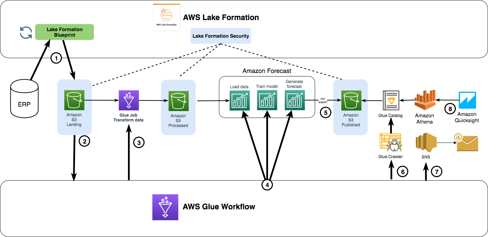
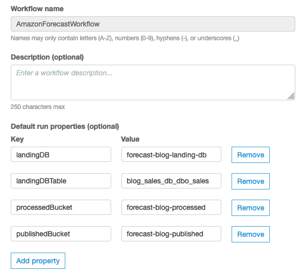

# Amazon Forecast Automation
An end to end inventory forecasting demo using AWS Lake Formation for data lake and Amazon Forecast for generating AI driven inventory forecasts.

AWS Glue jobs orchestrated via AWS Glue Workflow to automate the data import, training the predictor and generating forecast export from the Amazon Forecast service.

This is the supporting code for the blogpost <b> "Building end to end automated inventory forecasting capability with AWS Lake Formation and Amazon Forecast" </b>.

## Instructions
1. Create an IAM role for the Glue service and add a trust policy for Amazon Forecast
2. Attach the in-line IAM policy from this repo to the Glue IAM role
3. Create the AWS Glue jobs from this repo
4. Create an AWS Glue Workflow to orchestrate the Glue jobs in the following order with an event trigger in the middle of each:  
4.1 spark-transform-rawdata.py  
4.2 importDatasetJob.py  
4.2 checkImportJob.py  
4.3 trainPredictorJob.py  
4.4 checkPredictorJob.py  
4.5 createForecastJob.py  
4.6 checkForecastJob.py  
4.7 exportForecastJob.py  
4.6 checkExportJob.py

## Components
1. AWS Glue PySpark job to transform raw data into required format for Amazon Forecast
2. AWS Glue Python shell jobs to load data, train predictor, generate forecast and export forecast to s3 bucket
3. AWS Glue Workflow DAG to orchestrate the above functions

## License

This project is licensed under the Apache-2.0 License.

